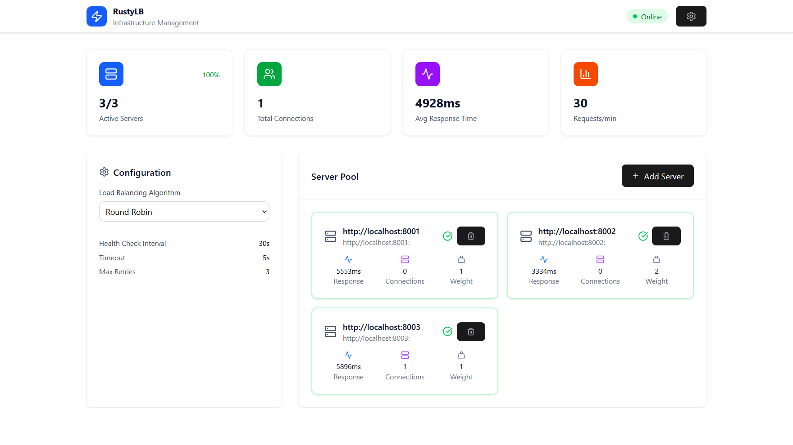

# ⚖️ Node.js Load Balancer with Real-Time Dashboard

A custom **Load Balancer** built in Node.js that distributes traffic across multiple backend servers.  
It supports **HTTP (Axios)** and **WebSockets (Socket.IO)** for real-time communication and monitoring.  
Includes a **developer dashboard** to visualize server pool statistics in real-time.

---

##  Features

- **Multiple Load Balancing Algorithms**
  - **Round Robin** – Distributes requests in sequential order.
  - **Least Connections** – Routes traffic to the server with the fewest active connections.
  - **Weighted Round Robin** – Prioritizes servers with higher weights.
  - **Random** – Chooses a random healthy server.

- **Real-Time Dashboard**
  - View **all servers in the pool** at a glance.
  - Monitor:
    - Active connections per server
    - Average & max response times
    - Server health (healthy / down)
    - Error counts
    - Total requests served
  - Data is updated in **real-time using WebSockets**.

- **Server Health Tracking**
  - Detects failures and marks servers as unhealthy automatically.
  - Recovery mechanism to reset server health.

---
##  Dashboard Preview

Below is an example dashboard (replace with your actual screenshot):

---

The React frontend (BalancerBoard) is deployed as a **static site**:

- [RustyLB Frontend](https://rustylb-1-nteq.onrender.com/)

The frontend connects to the LoadBalancer backend via WebSockets and REST API.

The LoadBalancer backend handles routing requests to multiple servers using various load balancing algorithms:

- [RustyLB LoadBalancer](https://rustylb-vz2m.onrender.com)

The LoadBalancer distributes requests to the following servers:

1. [Server 1](https://rustylb.onrender.com)
2. [Server 2](https://rustylb-2.onrender.com)
3. [Server 3](https://rustylb-3.onrender.com)
